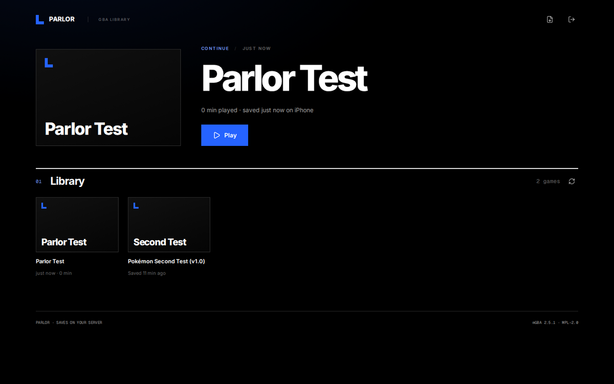
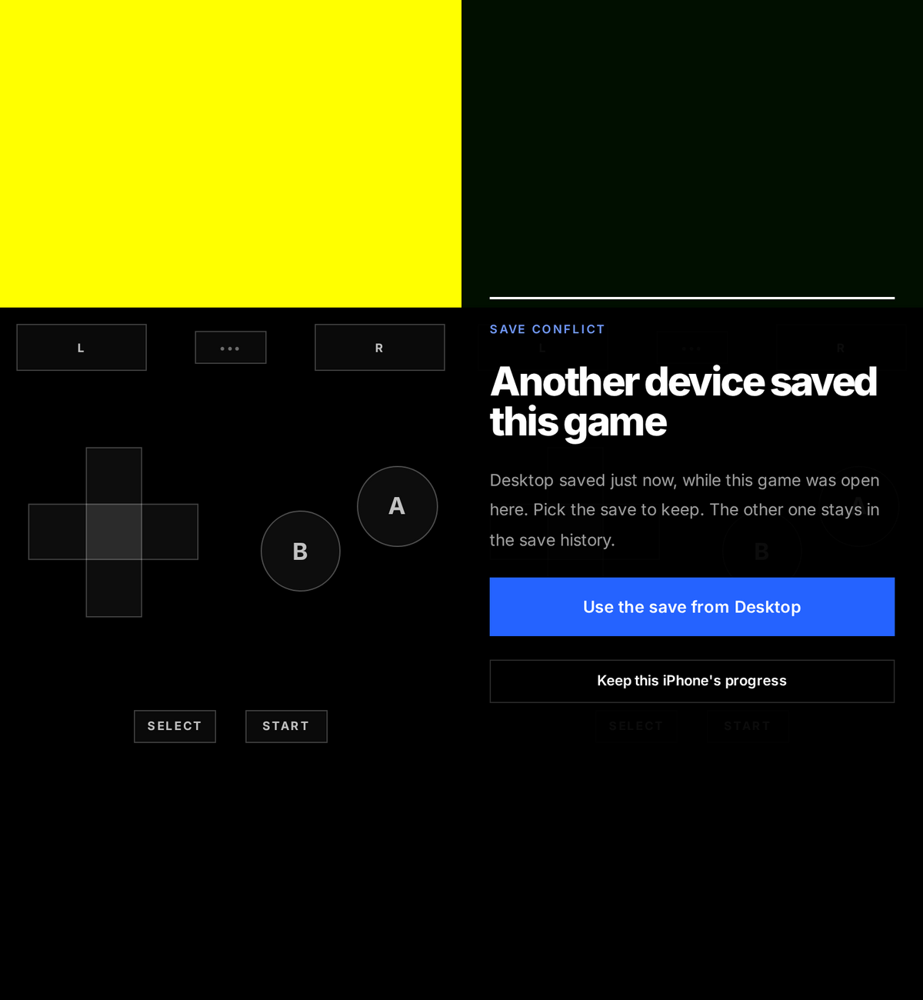

# Parlor

Your Game Boy Advance library, playable from any browser and built for the
iPhone first, with every game's save kept on your server. The emulator is
[mGBA](https://mgba.io) compiled to WebAssembly, so games behave the way
they do in mGBA-based emulators and their saves work there too. It runs on
your device; the server is a small Go binary that serves the files and keeps
the saves.



- **Library**: scans a folder of `.gba` files (read-only) every 10 minutes
  or when you press rescan. The last game played comes first, with play
  time, when you last played and when it was last saved. A renamed or
  moved ROM keeps its saves. Each game has its own notes.
- **Touch controls**: an installable home-screen app with no browser bars,
  zooming or scrolling. Portrait puts the screen on top and the controls
  below, like a GBA SP; in landscape the game fills the screen's height and
  see-through controls sit over it. Every
  finger is tracked, so you can hold a direction while pressing A, slide
  from one button to the next, or press A and B together. Hit zones are
  bigger than the buttons drawn, and the d-pad gives straight directions
  more room than diagonals, so walking a grid doesn't slip.
- **Keyboard** on desktop: arrows, X/Z for A/B, A/S for L/R, Enter and
  Backspace for Start and Select, F for fast forward, Esc for the menu.
- **Saves on the server**: whenever the game saves, the save goes to the
  server within a second. It's also sent when the app goes to the
  background, since iOS may close it there. With no connection, saves wait
  on the device and are sent when it's back.
- **Two devices, one save**: if another device saved the game after this
  one loaded it, Parlor pauses and asks which save to keep. The other one
  stays in the history either way.
- **Save history**: the last 20 saves per game, plus one a day for the
  month before. Restore any of them (restoring adds a new version, so
  nothing is lost). Download any as `.srm`, or upload one from another
  emulator.
- **Import**: a one-time page that finds `.srm` and `.sav` files in an
  import folder (RomM's assets, copied RetroDECK saves), matches them to
  games by name (`Pokemon Heart and Soul.srm` → `Pokémon Heart and Soul
  (v2.0.4).gba`), and adds them to the history dated by the file.
- **Fast forward**: a ▶▶ toggle next to the menu button (F on a keyboard,
  or from the menu). It runs at 2× by default; choose 2×, 3×, 4×, 6× or 8×
  in Settings, which apply to every device.
- Mute in the in-game menu. The screen stays awake while you play.



Still to come: a layout editor, Bluetooth controllers, save states,
per-game overrides (save type, real-time clock), patching ROM hack updates
with the save carried over, custom covers and a Foyer widget.

## Install

```yaml
services:
  parlor:
    image: ghcr.io/audemed44/parlor:latest
    container_name: parlor
    restart: unless-stopped
    environment:
      - PARLOR_TOKEN=${PARLOR_TOKEN} # openssl rand -hex 32
      - TZ=Asia/Kolkata
    volumes:
      - ./roms/gba:/roms:ro
      - ./parlor:/data
    ports:
      - "8088:8080"
```

[`docker-compose.example.yml`](docker-compose.example.yml) has every
option. The container runs as UID 1000, so `./parlor` must be writable by
it. Sign in with `PARLOR_TOKEN`; changing it signs every browser out.

Serve it over **HTTPS** behind your proxy. Phones need it for the
home-screen app, the ROM cache and the session cookie. The emulator also
needs the page to be cross-origin isolated: Parlor sends the
`Cross-Origin-Opener-Policy` and `Cross-Origin-Embedder-Policy` headers
itself, and your proxy must pass them through unchanged. On the iPhone,
open it in Safari and use **Share → Add to Home Screen**.

Keep the data folder in your backups: it holds the database and every save
version, and they belong together.

| Variable | Default | |
| --- | --- | --- |
| `PARLOR_TOKEN` | required | Sign-in token |
| `PARLOR_ROMS` | `/roms` | Folder of `.gba` files, searched recursively; mount it read-only |
| `PARLOR_DATA_DIR` | `/data` | Database and saves |
| `PARLOR_SAVE_VERSIONS` | `20` | Recent saves kept per game (plus one a day for 30 days) |
| `PARLOR_IMPORT_DIR` | off | Folder to import `.srm`/`.sav` files from |
| `PARLOR_LISTEN` | `:8080` | Listen address |
| `PARLOR_SECURE_COOKIES` | `true` | `false` only for plain-HTTP testing |
| `HOMEPAGE_URL` | off | Foyer's address, linked from the header |
| `TZ` | UTC | Which day a save belongs to, for the daily history |

## How saves work

Only in-game saves (what the game writes when you choose Save, `.srm`) are
kept. Save states aren't yet. A game loads with the newest save from the
server. Each upload says which version it was made on top of; if that isn't
the newest any more, the server refuses it and you choose. ROMs are cached
on the device by checksum, so each game downloads once.

## Development

```sh
cd frontend && npm install && npm run build && cd ..
go run ./cmd/testrom /tmp/roms/test.gba   # a homebrew ROM: A counts up in the save
PARLOR_TOKEN=dev-token-0123456789 PARLOR_ROMS=/tmp/roms PARLOR_DATA_DIR=/tmp/parlor \
  PARLOR_SECURE_COOKIES=false go run ./cmd/parlor
```

`npm run dev` in `frontend/` serves the UI with hot reload and proxies the
API to `localhost:8080`. See [AGENTS.md](AGENTS.md) for the checks to run
before pushing.

## Licence

The mGBA core (`@thenick775/mgba-wasm`, a WebAssembly build of
[mGBA](https://github.com/mgba-emu/mgba)) is MPL-2.0 and is served as its
own unmodified files under `/core/`.
