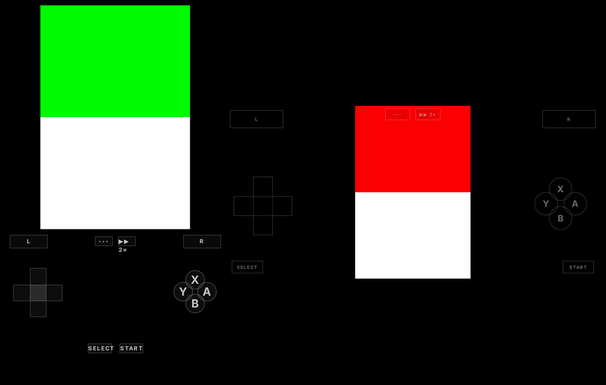

# Parlor

Your Game Boy Advance, Game Boy, NES, Super Nintendo, DS and 3DS library,
playable from any browser and built for the iPhone first, with every game's
save kept on your server. GBA games run on [mGBA](https://mgba.io)
compiled to WebAssembly; the other consoles run RetroArch cores through
[EmulatorJS](https://emulatorjs.org) (FCEUmm, Snes9x, Gambatte and
melonDS), so saves work in RetroArch-based emulators too. Those emulators
run on your device; the server is a small Go binary that serves the files
and keeps the saves. The 3DS is too heavy for a phone's browser, so it
plays on the server's GPU instead and streams to the browser
([parlor-stream](#3ds-parlor-stream)).


- **Library**: scans a folder of ROMs (read-only) every 10 minutes or when
  you press rescan: `.gba`, `.gb`, `.gbc`, `.nes`, `.sfc`/`.smc`,
  `.nds` and `.3ds`/`.cci`, in any folders (RomM's `<console>/roms` layout works as it is).
  With more than one console there's a filter for each. The last game played comes first, with play
  time, when you last played and when it was last saved. A renamed or
  moved ROM keeps its saves. Each game has its own notes.
- **Touch controls**: an installable home-screen app with no browser bars,
  zooming or scrolling. Portrait puts the screen on top and the controls
  below, like a GBA SP; in landscape the game fills the screen's height and
  see-through controls sit over it. Every
  finger is tracked, so you can hold a direction while pressing A, slide
  from one button to the next, or press A and B together. Hit zones are
  bigger than the buttons drawn, and the d-pad gives straight directions
  more room than diagonals, so walking a grid doesn't slip. Each console
  gets its buttons: X and Y in a diamond for the SNES and DS, no L and R
  for the NES and Game Boy.
- **DS**: both screens one above the other, in portrait and in landscape
  (controls either side). Tap the bottom screen to touch it. DS ROMs are
  sent without their cartridge padding (a 512 MB file is often 280 MB of
  game).
- **3DS**: played on the server and streamed (see
  [parlor-stream](#3ds-parlor-stream)), at 1× to 4× the 3DS's resolution,
  chosen in the menu while playing. Both screens one above the other; tap
  the bottom one. The d-pad also works the Circle Pad, which 3DS games
  walk with. Saves and states stay on the server without passing through
  the phone, and quitting keeps your place like any other game.
- **Layout editor**: Edit layout in the menu lets you drag the touch
  controls anywhere, resize them and set how see-through they are.
  Portrait and landscape each have their own layout, per console, kept on
  the device.
- **Bluetooth controllers**: Xbox, PlayStation and MFi controllers paired
  with the phone. While one is connected the touch controls step aside,
  leaving only a menu button. The left stick works as the d-pad too. The
  controller's Y is Y on the SNES and DS, and opens the menu elsewhere.
  Remap the buttons in Settings, per device, including quick save and load.
- **Keyboard** on desktop: arrows, X/Z for A/B, A/S for L/R (SNES and DS:
  S/A for X/Y, Q/W for L/R), Enter and Backspace for Start and Select, F
  for fast forward, Esc for the menu.
- **Saves on the server**: whenever the game saves, the save goes to the
  server within a second. It's also sent when the app goes to the
  background, since iOS may close it there. With no connection, saves wait
  on the device and are sent when it's back.
- **Two devices, one save**: if another device saved the game after this
  one loaded it, Parlor pauses and asks which save to keep. The other one
  stays in the history either way.
- **Save history**: the last 20 saves per game, plus one a day for the
  month before. Restore any of them (restoring adds a new version, so
  nothing is lost). Download any as `.srm`, or upload one from another
  emulator.
- **Save states**: four quick slots per game in the menu, each with a
  screenshot, on the server so any device can load them. Leaving a game
  (quitting, or switching away on the phone) keeps your place, and the next
  start, on any device, offers to continue from there.
- **Import**: a one-time page that finds `.srm` and `.sav` saves and
  `.state` (RomM) and `.ss1` (mGBA) save states in an import folder
  (RomM's assets, copied RetroDECK saves), matches them to games by name
  (`Pokemon Heart and Soul.srm` → `Pokémon Heart and Soul (v2.0.4).gba`;
  a file in a console's folder, like `nds/`, only matches that console),
  and adds saves to the history dated by the file. A game's newest state
  goes to "left off", so you carry on from it.
- **Patches**: apply an `.ips`, `.ups` or `.bps` patch to its clean base
  ROM. For an update to a hack you play (a new Heart and Soul version),
  Update with a patch on the game's page makes the new version its own
  game starting from the old one's save, notes and play time, and hides
  the old one. UPS and BPS patches find their base ROM by checksum.
  Patched ROMs are kept in the data folder; the ROM folder stays read-only.
- **Per-game settings**: for GBA games, the save type and real-time clock
  (day and night in hacks) when mGBA's detection gets them wrong. Patching
  works for ROMs up to 32 MB (not DS games). Custom covers for any game:
  upload artwork, or use a save state's screenshot.
- **Fast forward**: a ▶▶ toggle next to the menu button (F on a keyboard,
  or from the menu). It runs at 2× by default; choose 2×, 3×, 4×, 6× or 8×
  in Settings, which apply to every device.
- Mute in the in-game menu. The screen stays awake while you play.
- **Foyer widget**: "Continue: Unbound, 2 h ago" with a link into the
  game, the games played after it, and play time.





## Install

```yaml
services:
  parlor:
    image: ghcr.io/audemed44/parlor:latest
    container_name: parlor
    restart: unless-stopped
    environment:
      - PARLOR_TOKEN=${PARLOR_TOKEN} # openssl rand -hex 32
      - TZ=Asia/Kolkata
    volumes:
      - ./roms:/roms:ro # e.g. roms/gba, roms/nds
      - ./parlor:/data
    ports:
      - "8088:8080"
```

[`docker-compose.example.yml`](docker-compose.example.yml) has every
option. The container runs as UID 1000, so `./parlor` must be writable by
it. Sign in with `PARLOR_TOKEN`; changing it signs every browser out.

Serve it over **HTTPS** behind your proxy. Phones need it for the
home-screen app, the ROM cache and the session cookie. The emulator also
needs the page to be cross-origin isolated: Parlor sends the
`Cross-Origin-Opener-Policy` and `Cross-Origin-Embedder-Policy` headers
itself, and your proxy must pass them through unchanged. On the iPhone,
open it in Safari and use **Share → Add to Home Screen**.

Keep the data folder in your backups: it holds the database, every save
version, save states, patched ROMs and covers, and they belong together.

### Foyer

Parlor serves a [Foyer](https://github.com/audemed44/foyer) widget at
`/api/foyer/widget`; Foyer offers to add it in edit mode, or:

```yaml
      - name: Parlor
        url: https://parlor.example.com
        widget:
          type: app
          url: http://parlor:8080/api/foyer/widget
          key: ${PARLOR_TOKEN}
```

| Variable | Default | |
| --- | --- | --- |
| `PARLOR_TOKEN` | required | Sign-in token |
| `PARLOR_ROMS` | `/roms` | Folder of ROMs, searched recursively; mount it read-only |
| `PARLOR_DATA_DIR` | `/data` | Database and saves |
| `PARLOR_SAVE_VERSIONS` | `20` | Recent saves kept per game (plus one a day for 30 days) |
| `PARLOR_IMPORT_DIR` | off | Folder to import `.srm`/`.sav` files from |
| `PARLOR_LISTEN` | `:8080` | Listen address |
| `PARLOR_SECURE_COOKIES` | `true` | `false` only for plain-HTTP testing |
| `HOMEPAGE_URL` | off | Foyer's address, linked from the header |
| `TZ` | UTC | Which day a save belongs to, for the daily history |

## 3DS: parlor-stream

A 3DS game is far too heavy for a phone's browser (and its ROM is
gigabytes), so `parlor-stream` plays it on the server's GPU and streams
the picture and sound to the browser over WebRTC, with your buttons and
touches going back the same way. It runs beside Parlor, which hands it the
games: one at a time, and starting one on another device takes it over,
keeping your place. It uses the [Azahar](https://azahar-emu.org) libretro
core and needs decrypted 3DS dumps (`.3ds`/`.cci`).

```yaml
  parlor-stream:
    image: ghcr.io/audemed44/parlor-stream:latest
    container_name: parlor-stream
    restart: unless-stopped
    environment:
      - PARLOR_TOKEN=${PARLOR_TOKEN} # the same as Parlor's
      - PARLOR_URL=http://parlor:8080
      # The server's addresses browsers reach (e.g. its Tailscale IP).
      - PARLOR_STREAM_HOSTS=100.64.0.1
    volumes:
      - ./romm/library:/roms:ro # the same ROM folder as Parlor's
      - ./parlor-stream:/data # system files and shader caches
    devices:
      - /dev/dri:/dev/dri # AMD or Intel GPU
    group_add:
      - "993" # the host's render group: getent group render
    ports:
      - "8089:8089/udp" # the stream; keep the same port on both sides
```

and on Parlor, `PARLOR_STREAM_URL=http://parlor-stream:8090`. The
streams don't go through your reverse proxy: the browser connects to
`PARLOR_STREAM_HOSTS` on UDP port 8089 directly, so that address must be
reachable from your devices (over Tailscale, the server's Tailscale IP).

The game renders at the resolution chosen in the menu and is scaled down
to at most `PARLOR_STREAM_MAX_HEIGHT` pixels tall for the stream (1440,
which is 3×; rendering at 4× still sharpens it). Fast forward runs up to
4×, as fast as the server manages, with the sound sped up. How far you can
go depends on the GPU and CPU. Measured with a Ryzen 5 3550H: on its Radeon Vega 8 2× plays
at full speed and fast forwards to about 1.5×, while 3× and 4× run below
full speed; on a GeForce GTX 1650 3× and 4× play at full speed and fast
forward to about 2× (the CPU is then the limit). For a discrete NVIDIA GPU,
use NVIDIA's driver and the
[NVIDIA Container Toolkit](https://docs.nvidia.com/datacenter/cloud-native/container-toolkit/):
replace `devices` and `group_add` with

```yaml
    runtime: nvidia
    environment:
      - NVIDIA_VISIBLE_DEVICES=all
```

parlor-stream then renders on it and encodes with NVENC. Its log reports
how the game keeps up every 30 s (`performance emulated_fps=...`).

| Variable | Default | |
| --- | --- | --- |
| `PARLOR_TOKEN` | required | Parlor's token: Parlor uses it to start games, and parlor-stream to keep saves and states in Parlor |
| `PARLOR_URL` | `http://parlor:8080` | Parlor, from parlor-stream |
| `PARLOR_STREAM_HOSTS` | none | Comma-separated IPs browsers reach the server on |
| `PARLOR_STREAM_UDP_PORT` | `8089` | The stream's UDP port (publish it as the same number) |
| `PARLOR_STREAM_SCALE` | `2` | Resolution a game starts at, 1 to 4, until changed in the menu |
| `PARLOR_STREAM_MAX_HEIGHT` | `1440` | Tallest stream, in pixels; taller frames are scaled down |
| `PARLOR_STREAM_KBPS` | by size | Video bitrate (3 to 20 Mbit/s by default) |
| `PARLOR_STREAM_GPU` | `auto` | Render node, like `/dev/dri/renderD128`; auto prefers NVIDIA's driver |
| `PARLOR_STREAM_ENCODER` | `auto` | `vaapi`, `nvenc` or `x264` (CPU) |

A 3DS game's save is a folder of files on its SD card, so Parlor keeps it
as a `.tar` of that folder; download one from the history to back it up,
or upload one to restore it.

## How saves work

In-game saves (what the game writes when you choose Save, `.srm`) are the
ones that count, with their history. A game loads with the newest save from
the server. Each upload says which version it was made on top of; if that
isn't the newest any more, the server refuses it and you choose. ROMs are
cached on the device by checksum, so each game downloads once.

Save states are snapshots on the side: a slot holds one, and saving to it
again replaces it. Loading a state never rolls the server's save back: mGBA
leaves the in-game save out of states, and for the other consoles the save
a state carries isn't uploaded; only the game saving again is. Save in the
game as usual.

Games EmulatorJS runs play on `/play`, the same app with a looser content
security policy: the RetroArch cores' glue code needs `'unsafe-eval'` and
loads its WebAssembly from `blob:` URLs. The rest of the app keeps the
strict policy, and leaving a game goes back to it. Leaving an EmulatorJS
game reloads the page, which also frees its memory.

## Development

```sh
cd frontend && npm install && npm run build && cd ..
go run ./cmd/testrom /tmp/roms/test.gba   # a homebrew ROM: A counts up in the save
# also .gb, .gbc, .nes, .sfc and .nds (the DS one turns green when touched)
PARLOR_TOKEN=dev-token-0123456789 PARLOR_ROMS=/tmp/roms PARLOR_DATA_DIR=/tmp/parlor \
  PARLOR_SECURE_COOKIES=false go run ./cmd/parlor
```

`npm run dev` in `frontend/` serves the UI with hot reload and proxies the
API to `localhost:8080`. See [AGENTS.md](AGENTS.md) for the checks to run
before pushing.

## Licence

The mGBA core (`@thenick775/mgba-wasm`, a WebAssembly build of
[mGBA](https://github.com/mgba-emu/mgba)) is MPL-2.0 and is served as its
own unmodified files under `/core/`.

parlor-stream's image includes the [Azahar](https://github.com/azahar-emu/azahar)
libretro core (GPL-2.0), unmodified from its release, and Ubuntu's FFmpeg
and Mesa libraries; it uses [Pion](https://github.com/pion/webrtc) (MIT)
for WebRTC and libretro's `libretro.h` (MIT).

[EmulatorJS](https://github.com/EmulatorJS/EmulatorJS) is GPL-3.0, and its
RetroArch cores have their own licences: FCEUmm and Gambatte GPL-2.0,
melonDS GPL-3.0, and Snes9x its own non-commercial licence. They're
downloaded at build time from EmulatorJS's releases and served unmodified
under `/ejs/`, with `NOTICE.txt` listing each one's source.
